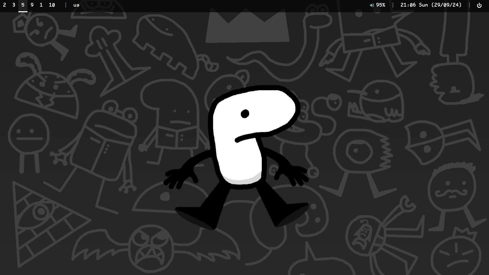
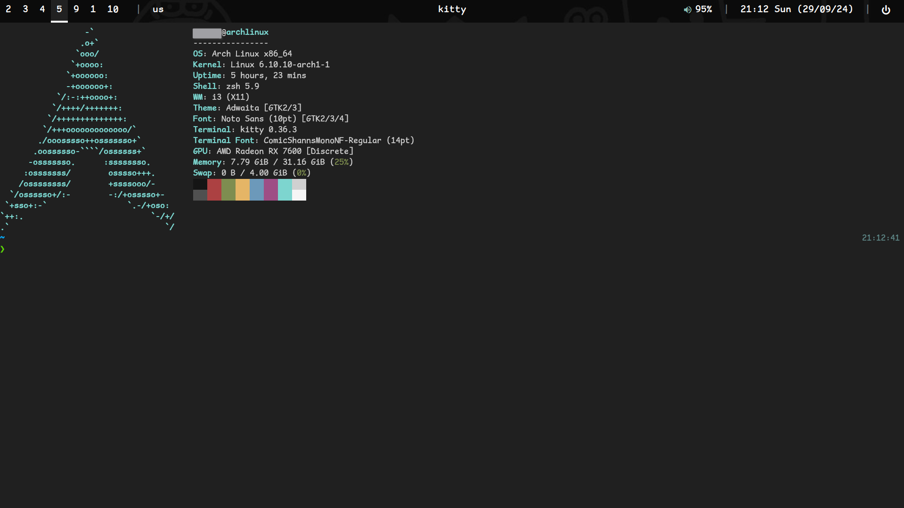

# dotfiles
my dotfiles that are a fork of Livakivi's dotfiles
[here are livakivi's dotfiles](https://github.com/Livakivi/config-files/)  

# how 2 install

command to install right after installing arch:
### warning!!! this will delete your current config maybe sometime depends on the weather
```
sudo pacman -S git && sudo pacman -S --needed git base-devel && git clone https://aur.archlinux.org/yay.git && cd yay && makepkg -si && source ~/.bashrc && git clone https://github.com/nooby124/dotfiles && cp dotfiles ~/ && yay -S alacritty dunst fastfetch i3 lf neofetch neovim picom polybar rofi git fzf bat xsel rofi-greenclip kdeconnectd playerctl ksnip nitrogen cbonsai fortune cowsay lolcat sl exa && yay -S zsh && sh -c "$(curl -fsSL https://raw.githubusercontent.com/ohmyzsh/ohmyzsh/master/tools/install.sh)" && git clone --depth=1 https://github.com/romkatv/powerlevel10k.git ${ZSH_CUSTOM:-$HOME/.oh-my-zsh/custom}/themes/powerlevel10k && echo source ~/.aliasses.zsh >> ~/.zshrc
```  

after that change you need to change `ZSH_THEME` in `~/.zshrc` to powerlevel10k/powerlevel10k  


you also need to install `0xProto Nerd Font` and `ComicShannsMono Nerd Font`. you can do that from the nerdfonts website: https://www.nerdfonts.com/font-downloads  
____
## screenshots
  


