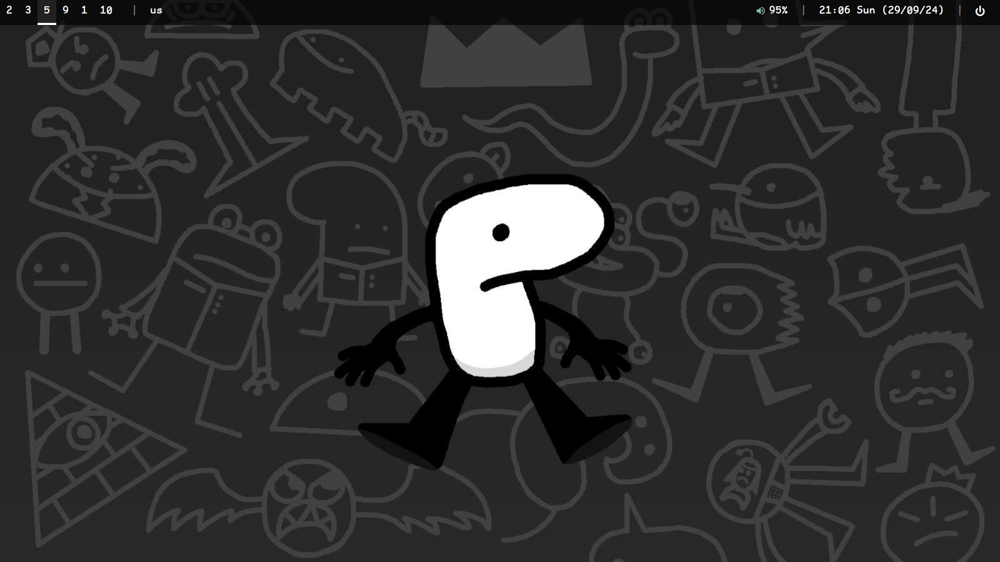
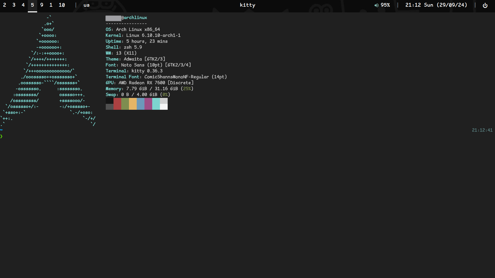

my dotfiles that are a fork of Livakivi's dotfiles
[here are livakivi's dotfiles](https://github.com/Livakivi/config-files/)  

# how 2 install
### warning!!! this will delete your current config maybe sometime depends on the weather
clone this repo   
run the `install.sh` file  
after that change you need to change `ZSH_THEME` in `~/.zshrc` to powerlevel10k/powerlevel10k  
you also need to install `0xProto Nerd Font` and `ComicShannsMono Nerd Font`. you can do that from the nerdfonts website: https://www.nerdfonts.com/font-downloads  
____
## screenshots
  

# credits
[rofi calendar](https://github.com/ghost-in-the-machine-86/rofi-calendar) by [ghost-in-the-machine-86](https://github.com/ghost-in-the-machine-86)  

[dunst-media-control](https://github.com/Shringe/dunst-media-control) by [Shringe](https://github.com/Shringe)
